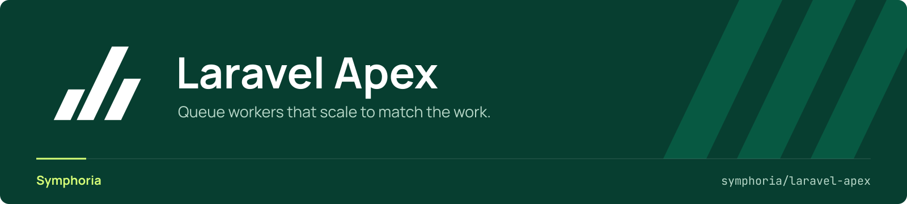

<p align="center">
  <a href="https://github.com/symphoria-io/laravel-apex">
    
  </a>
</p>

<p align="center">
  <a href="https://github.com/symphoria-io/laravel-apex/actions/workflows/tests.yml"></a>
  <a href="https://packagist.org/packages/symphoria/laravel-apex"></a>
  <a href="https://packagist.org/packages/symphoria/laravel-apex"></a>
  <a href="LICENSE"></a>
</p>

# symphoria/laravel-apex

A queue worker supervisor that scales workers to match the work.

It reads backlog straight out of the queue, decides how many processes each queue needs, and starts and retires them. Not a queue backend and not a replacement for one — that stays Laravel's `redis` or `database` driver.

## What it does

**Scales to actual zero.** A queue with `min_processes: 0` runs no processes at all when nothing is queued, and gets them back the moment work arrives. What stays behind is the master itself, one PHP process per installation, so idle queues cost nothing beyond it.

**Keeps a warm pool while people are around.** `min_processes_when_active` holds workers ready as long as there is human traffic, and drops back to the floor when there is not. Users never wait for a cold start; nights and weekends are free. Activity comes from a middleware that ignores your dashboard's own polling, so the monitoring screen cannot manufacture the load it displays.

**Prevents boot storms.** Spawning is throttled globally: at most `max_concurrent_boots` workers booting at once, spaced by `boot_spawn_interval_ms`. Without it, a queue going from 0 to 8 workers means eight simultaneous framework boots, and several installations doing that together will flatten a server.

**Scales up now, down slowly.** Growth is immediate. Shrinking waits out `scale_down_debounce_seconds` and a worker's `shrink_min_lifetime_seconds`, so a momentary dip cannot start a kill/spawn oscillation.

**Bursts, but watches the machine.** When a queue stays above its threshold long enough, Apex adds workers past the normal maximum — unless CPU is already above `cpu_max_percent`. One burst worker per tick, so the OS gets a chance to report the load its predecessor caused.

**Profiles instead of per-queue guesswork.** `latency-critical`, `throughput` and `background` set strategy, targets, memory, timeouts and retries in one word. Queues override individual keys, environments override queues.

**Two scaling strategies.** `depth` sizes on backlog; `hybrid` also watches how long the oldest job has been waiting, so a slow queue scales up before the backlog looks alarming.

**Sub-50ms pickup on Redis 7+.** With phpredis, workers block on `BLMPOP` across all their queues at once rather than polling each in turn. Falls back to polling automatically on older Redis, on predis, and on the database driver.

**Runs without Redis.** Redis, or the database, or one of each — see [Running without Redis](#running-without-redis).

**Answers what happened.** Per-minute throughput history, a recent-jobs inspector with payloads and runtimes, worker lifecycle events, and live per-worker heartbeats — over JSON, so the UI stays yours.

**Stops queues on your terms.** Operators pause; your application suspends. Both scale to zero, both survive a restart, and they do not overwrite each other.

**One supervisor per installation.** A second `apex:start` refuses and tells you which host and pid holds the lock, because two masters cannot see each other's workers and would scale the same queues past every maximum. `--force` takes over, and a killed master's claim lapses on its own.

## Install

```bash
composer require symphoria/laravel-apex
php artisan vendor:publish --tag=apex-config
php artisan migrate
php artisan apex:start
```

Migrations are loaded, not published. Publishing them makes you the owner of the schema from that moment on, so later column additions never reach you.

## Configuring a queue

```php
'queues' => [
    'chat' => [
        'profile' => 'latency-critical',
        'min_processes' => 0,           // nothing running when nothing is queued
        'min_processes_when_active' => 2, // warm pool while people are using the app
        'max_processes' => 8,
        'use_activity' => true,
    ],

    'reports' => [
        'profile' => 'background',
        'queues' => ['reports', 'reports-bulk'], // one pool reading several queues
        'max_processes' => 2,
    ],
],

'environments' => [
    'production' => ['queues' => ['chat' => ['max_processes' => 24]]],
],
```

A profile supplies everything you did not: strategy, targets, memory limit, timeouts, retries. `php artisan apex:config:show` prints what every queue actually resolved to after profile, queue and environment have been merged.

## Running without Redis

Apex uses two backends, and it is worth keeping them apart:

- **The queue** is Laravel's. Apex reads pending work straight out of it to decide how many workers to run, which it can do for the `redis` and `database` drivers. Any other driver offers no way to ask "how much is waiting", so `apex:start` refuses it.
- **The store** is where Apex keeps its own coordination state: worker heartbeats, pause flags, counters and the job timelines behind the dashboard.

By default the store follows the queue driver, so neither needs configuring:

```dotenv
QUEUE_CONNECTION=database   # Apex stores its state in the database too
```

**"No Redis" means both.** Setting `APEX_STORE=database` while `QUEUE_CONNECTION=redis` still requires a Redis server — the store moved, the queue did not.

The two are configurable separately because the combination is occasionally what you want:

```dotenv
APEX_STORE=database         # blank derives it from the queue driver
APEX_DB_CONNECTION=apex     # blank uses the default database connection
```

`php artisan apex:config:show` prints the active store, the depth probe, and for each timing setting whether the effective value was configured or inherited from the store's default.

### What it costs

Every operation is a query instead of a pipelined Redis command, so the master ticks more slowly on the database store: 1s instead of 250ms, 5s instead of 1s when idle. Those are defaults per store; `APEX_TICK_INTERVAL_MS` and `APEX_IDLE_TICK_INTERVAL_MS` override them.

Job pickup latency is unaffected. A warm worker takes a job off the queue itself; the master's tick only decides whether to add or remove workers. What a slower tick costs you is scale-*up* speed on a cold pool.

Redis is still the better backend under load, and `BLMPOP` (Redis 7+) gives sub-50ms pickup that database polling cannot match. The database store exists so that Apex is usable at all where Redis is not, not to be equivalent.

There is no `file` driver, and there will not be one: it means writing your own locking, which fails differently on Windows and silently on network shares. If you want "one file, no daemon", point `APEX_DB_CONNECTION` at a SQLite connection with WAL enabled.

## Access to the control API

The package ships a JSON API that can pause queues and flush failed jobs, so **access is denied outside `local` by default**. Same model Horizon uses, and for the same reason.

Open it in one of two ways:

```php
// AppServiceProvider::boot()
Apex::auth(fn (Request $request) => $request->user()?->isAdmin() === true);
```

```php
Gate::define('viewApex', fn ($user) => $user->can('admin.apex.dashboard.view'));
```

The package deliberately ships **no screen**. It owns the data and the control actions; you own the UI. Endpoints live under `config('apex.dashboard.path')`, default `apex`:

| Method | Path | Name |
|---|---|---|
| GET | `apex/api/snapshot` | `apex.api.snapshot` |
| POST | `apex/api/queues/pause` | `apex.api.queues.pause` |
| POST | `apex/api/queues/resume` | `apex.api.queues.resume` |
| GET | `apex/failed/api/list` | `apex.failed.api.list` |
| GET | `apex/recent/api/list` | `apex.recent.api.list` |
| GET | `apex/workers/api/list` | `apex.workers.api.list` |
| GET | `apex/history/api/index` | `apex.history.api.index` |

Set `apex.dashboard.enabled` to `false` and no routes are registered at all.

## Suspending queues from your own code

A queue can be stopped for reasons Apex knows nothing about — a disabled feature, a tenant over quota, a maintenance window. Implement one method:

```php
final class FeatureSuspensionSource implements QueueSuspensionSource
{
    public function suspendedQueues(): array
    {
        return Feature::disabled()
            ->flatMap(fn (string $name) => app(ApexConfig::class)->queuesForGroup($name))
            ->all();
    }
}
```

```php
$this->app->bind(QueueSuspensionSource::class, FeatureSuspensionSource::class);
```

Group related queues in config so you can suspend them as a unit:

```php
'queues' => [
    'invoices'  => ['profile' => 'throughput', 'group' => 'billing'],
    'reminders' => ['profile' => 'throughput', 'group' => 'billing'],
],
```

**Suspension is not the same as a pause.** A pause is an operator action Apex stores itself and rehydrates after a Redis flush. A suspension is derived state owned by your application; the master reconciles it on boot and clears any that no longer apply.

If you only need Laravel's own `queue:pause` to scale Apex down to zero, bind the shipped adapter instead:

```php
$this->app->bind(QueueSuspensionSource::class, LaravelPauseSuspensionSource::class);
```

It needs `Queue::getPausedQueues()` (Laravel 13.25+) and returns an empty array on older versions. A group counts as suspended only when every queue it reads is paused, so `queue:pause` on one of two queues leaves the group running — there is still work arriving on the other. `queue:pause --all` suspends everything.

## Overriding a model

```php
'models' => [
    'queue_state' => App\Models\ApexQueueState::class,
],
```

Your class must extend `Symphoria\Apex\Models\QueueState`. The resolver validates that and throws `InvalidConfiguration` with a usable message if it does not.

`QueueState::pausedBy()` is polymorphic, so the package never has to know your user model. **Register a morph alias** for whatever you store there — a raw FQCN in the database breaks the first time somebody renames the class.

## Public API

Covered by semver: everything in `src/Contracts/` and `src/Exceptions/`, the `Apex` resolver, config keys, model attributes and relation names, table names, route names, and the documented artisan commands.

Everything else is internal and may change within a major.

## Coming from Horizon

Both supervise workers, and for a single application with steady traffic Horizon is the easier answer: it ships a dashboard, it is first-party, and you already know it.

Apex exists for the case Horizon's `balanceMaxShift`/`balanceCooldown` model does not cover: many installations sharing one machine, most of them idle most of the time. Horizon's minimum is one process per queue and it has no notion of the machine as a whole, so twenty idle installations cost twenty times a worker that has nothing to do, and they will all boot at once when they wake. Apex's floor is genuinely zero, spawning is throttled globally, and bursting yields to CPU pressure.

What you give up: the dashboard (Apex ships JSON and no screen), and first-party support.

## Requirements

PHP 8.3+, Laravel 12 or 13, and a queue on the `redis` or `database` driver. Redis 7+ additionally enables `BLMPOP` pickup. See [Running without Redis](#running-without-redis).

## Development

```bash
composer install
composer test      # Pest
composer analyse   # PHPStan level 8, with an inherited baseline
composer lint      # Pint
```

## Contributing

Pull requests are welcome. [CONTRIBUTING.md](CONTRIBUTING.md) covers how to run the suite, what gets merged, and the few rules in the master loop that look arbitrary and are not.

## Code of conduct

So that this stays a place people want to contribute to, please read and follow the [code of conduct](CODE_OF_CONDUCT.md).

## Security

Found a vulnerability? **Do not open an issue.** Use [private vulnerability reporting](https://github.com/symphoria-io/laravel-apex/security/advisories/new). See the [security policy](SECURITY.md).

## Credits

<picture>
  <source media="(prefers-color-scheme: dark)" srcset="art/logo-white.svg">
  
</picture>

Built at [Symphoria B.V.](https://symphoria.io), extracted from the supervisor that runs our own installations.

## License

MIT. See [LICENSE](LICENSE).
